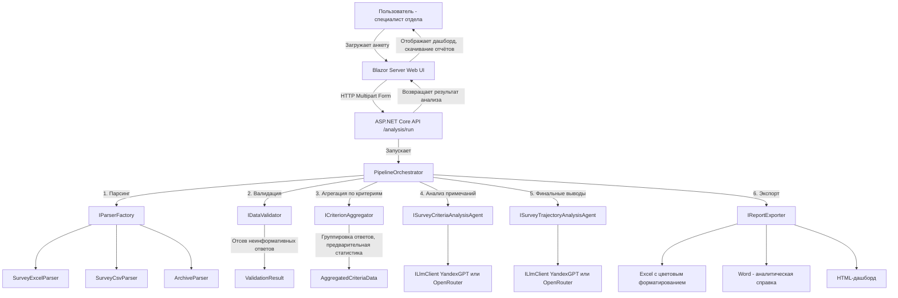

# LearnAInalytics  
## «Интеллектуальный анализ анкет обратной связи с применением ИИ-агентов»

---

## Содержание
1. [Введение](#введение)  
2. [Архитектура и проектные решения](#архитектура-и-проектные-решения)  
3. [Принципы работы ИИ-агентов и промптов](#принципы-работы-ии-агентов-и-промптов)  
4. [Руководство пользователя](#руководство-пользователя)  
5. [Руководство разработчика](#руководство-разработчика)  
6. [Руководство администратора](#руководство-администратора)  
7. [Шаблоны отчётов и глоссарий](#шаблоны-отчётов-и-глоссарий)  

---

## Введение

**LearnAInalytics** — система автоматического анализа анкет обратной связи слушателей образовательных программ с помощью групп ИИ-агентов. 
Проект разработан для Корпоративного университета Санкт-Петербурга и предназначен для специалистов отдела дизайна образовательных программ и экспертиз.

Основные возможности:
- Автоматический расчёт статистик: средние баллы, медианы, стандартные отклонения, распределения оценок.
- Интеллектуальный анализ текстовых комментариев: тематическое моделирование, сентимент-анализ, выявление ключевых проблем.
- Формирование структурированной аналитической справки (Word) и количественного отчёта (Excel).
- Построение интерактивного дашборда с визуализациями (линейчатая диаграмма, лепестковая диаграмма, тепловая карта корреляций, распределение оценок).
- Поддержка двух вариантов нейросетей: российских (YandexGPT) и зарубежных (OpenRouter).
- Экспорт результатов в Word, Excel и HTML.

---

## Архитектура и проектные решения

### Общая схема системы

Система построена на многослойной архитектуре **Onion / Hexagonal**, что обеспечивает модульность и масштабируемость.  
Верхнеуровневая диаграмма потоков данных:

```
[Пользователь] → (Blazor Web UI) → [HTTP API] → [Pipeline] → [Агенты LLM] → [Отчёт + Дашборд]
```

Основные модули:
- **API (ASP.NET Core Minimal API)** – принимает файл анкеты, запускает конвейер анализа.
- **Pipeline** – оркестрирует этапы обработки: парсинг → валидация → агрегация по критериям → вызов ИИ-агентов → сбор статистики → генерация отчёта и дашборда.
- **Parsing** – конвертирует входные Excel / CSV в унифицированные модели (`Survey`).
- **Validation** – отсеивает неинформативные ответы (прочерки, «затрудняюсь ответить», общие фразы), проверяет корректность оценок.
- **Analysis** – группирует ответы по пяти критериям (Полезность, Практика, Доступность, Взаимодействие, Вовлечённость), вычисляет статистики, вызывает ИИ-агентов для текстового анализа и генерации выводов.
- **Agent.Contracts** – интерфейсы `ILlmClient`, `IPromptProvider`; фабрика `ILlmFactory`.
- **Агенты** – реализации для YandexGPT и OpenRouter (OpenAI-совместимый интерфейс).
- **Reporting** – экспорт в Excel и Word с цветовым форматированием, генерация HTML-дашборда.
- **Web UI (Blazor Server)** – одна интерактивная страница для загрузки анкеты и отображения результатов с визуализациями.

### Диаграмма структуры проргаммы



### Обоснование выбора технологий
- **.NET 8 / C#** – высокая производительность, строгая типизация, удобство работы с данными.
- **Blazor Server** – быстрая разработка интерактивного UI без JavaScript, компонентный подход.
- **Абстракции IDataParser, ICriterionAggregator, IReportExporter** – легко добавлять новые форматы анкет, критерии анализа и форматы экспорта без изменения ядра.
- **Две группы агентов** – соответствие ТЗ; российская (YandexGPT) и зарубежная (OpenRouter) реализованы через единый контракт.

---

## Принципы работы ИИ-агентов и промптов

### Конвейер анализа

1. **Парсинг и валидация**  
   Анкета загружается в формате Excel/CSV. Парсер извлекает список вопросов и ответов. Валидатор очищает данные от прочерков, «затрудняюсь ответить», общих фраз («всё», «ничего») с учётом контекста вопроса.

2. **Агрегация по критериям**  
   Сервис `SurveyAggregator` распределяет вопросы по пяти критериям на основе ключевых слов в формулировках. Для каждого критерия собирается:  
   - статистика (средний балл, распределение оценок 1–10);  
   - текстовые ответы (только информативные, сгруппированные по вопросам).

3. **Генерация примечаний (агент анализа критериев)**  
   Для каждого критерия формируется промпт, содержащий статистику и текстовые ответы. Агент возвращает связный текст на 3–8 предложений деловым стилем, который будет включён в отчёт.

   Пример промпта:  
   ```
   Ты — аналитик образовательных программ.
   Проанализируй ответы слушателей по критерию «Полезность программы».
   Статистика: средний балл — 9.3 из 10. Распределение: 1-3: 0%, 4-7: 4.8%, 8-10: 95.2%.
   Ответы на вопросы:
   Вопрос: «Какие вопросы были наиболее актуальны?»
   - «создание промтов, презентаций, видео, картинок»
   ...
   На основе этих данных напиши Примечание на 3-8 предложений деловым стилем. Указывай точные цифры.
   ```

4. **Формирование траектории изменений (финальный агент)**  
   После получения всех примечаний и агрегированных данных (предложения исключить/добавить темы, распределение форматов обучения) вызывается второй агент. Он генерирует раздел «Траектория изменения программы» с конкретными выводами и рекомендациями.

5. **Сборка отчёта и дашборда**  
   Программно собирается `AnalysisResult`, который включает все статистики, примечания, траекторию и распределения. На его основе формируются Word-отчёт, Excel-таблица и HTML-дашборд с интерактивными графиками.

---

## Руководство пользователя

### 1. Начало работы
Откройте веб-интерфейс LearnAInalytics. Отображается страница анализа с формой загрузки файла анкеты.

### 2. Загрузка анкеты
- **Файл с ответами слушателей** (обязателен) – Excel (.xlsx) или CSV.  
  Структура: первая строка — заголовки вопросов, следующие строки — ответы слушателей (первые столбцы — ФИО и должность, могут быть пустыми).  
  Парсер автоматически распознаёт числовые (оценки 1–10), бинарные (да/нет) и открытые вопросы.

### 3. Выбор варианта ИИ-агента
- «Российские нейросети» – используется YandexGPT.
- «Зарубежные нейросети» – используется OpenRouter.

### 4. Запуск анализа
Нажмите кнопку «Запустить анализ». Появится индикатор выполнения. Анализ занимает от 10 до 60 секунд в зависимости от объёма данных.

### 5. Просмотр результатов
После завершения отображается интерактивный дашборд:
- **Линейчатая диаграмма** – средние баллы по 5 критериям.
- **Лепестковая диаграмма** – профиль удовлетворённости.
- **Тепловая карта (корреляционная матрица)** – взаимосвязи между критериями.
- **Распределение оценок** – доли низких, средних, высоких оценок.
- **Общая удовлетворённость** – средний балл по всем критериям.

### 6. Экспорт результатов
- **Скачать Excel** – количественный отчёт с таблицей средних баллов и распределений.
- **Скачать Word** – аналитическая справка со всеми разделами (общая информация, ключевые показатели, предложения слушателей, траектория изменений).
- **Скачать HTML-дашборд** – статическая версия дашборда для просмотра в браузере.

---

## Руководство разработчика

### Структура решения

```
LearnAInalytics.sln
├── Entities/              – сущности, enum, модели анкет
├── Parsing/               – парсеры Excel, CSV
├── Validation/            – валидация и очистка ответов
├── Analysis/              – агрегация, статистика, вызов агентов
├── Agent.Contracts/       – ILlmClient, IPromptProvider, IResponseParser
├── Agent.YandexGPT/       – клиент для YandexGPT
├── Agent.OpenAI/          – OpenAI-совместимый клиент (OpenRouter)
├── Reporting/             – экспортёры в Excel, Word, HTML
├── Services/              – оркестратор пайплайна
├── Api/                   – ASP.NET Core Web API
└── Web/                   – Blazor Server UI
```

### Настройка окружения

1. Клонируйте репозиторий.
2. В проекте `Api/appsettings.json` задайте ключи API:
   ```json
    "RussianLLM": {
      "BaseUrl": "https://llm.api.cloud.yandex.net/",
      "RequestUri": "foundationModels/v1/completion",
      "Model": "yandexgpt-lite",
      "ApiKey": "AQVN0...",
      "FolderId": "b1g..."
    },
    "ForeignLLM": {
      "BaseUrl": "https://openrouter.ai/api/v1/",
      "RequestUri": "chat/completions",
      "ApiKey": "sk-or-v1-...",
      "Model": "nvidia/nemotron-3-ultra-550b-a55b:free"
    }
   ```
3. В `Web/appsettings.json` укажите `ApiBaseUrl` (по умолчанию https://localhost:7051).

### Запуск через CLI
```bash
# API
cd Api
dotnet run

# Web
cd Web
dotnet run
```
Оба проекта должны быть запущены одновременно.

### Добавление нового критерия анализа
1. Дополните словарь `CriterionKeywords` в `SurveyAggregator`.
2. При необходимости обновите модель `CriterionPromptData` и `IPromptProvider`.
3. Агенты автоматически подхватят новый критерий.

---

## Руководство администратора

### Лимиты и безопасность
- YandexGPT: ограничения по квотам каталога (указываются в облаке).
- OpenRouter: бесплатный тир 20 запросов/мин, при необходимости можно перейти на платный план.

---

## Шаблоны отчётов и глоссарий

### Пример аналитической справки (Word)
- Содержит разделы: Общая информация о программе, Ключевые показатели (таблица распределения оценок, примечания), Предложения слушателей, Траектория изменения программы.
- Цветовое форматирование: оценки 1–4 (оранжевый), 5–7 (жёлтый), 8–9 (светло-зелёный), 10 (тёмно-зелёный); в вовлечённости преобладающий ответ подсвечивается зелёным; предпочтительная форма обучения ранжируется цветом.

### Пример Excel-отчёта
- Лист «Анализ программы»: таблица со средними баллами по всем критериям и общей удовлетворённостью.

### Глоссарий
- **Критерий** – один из пяти аспектов оценки программы (Полезность, Практико-ориентированность, Доступность, Взаимодействие с командой КУ, Вовлечённость).
- **Примечание** – текстовый анализ ответов слушателей по критерию, сгенерированный ИИ.
- **Траектория изменения программы** – итоговые выводы и рекомендации на основе всех данных.
- **ScoreDistribution** – распределение оценок от 1 до 10 по критерию.
- **Engagement** – вовлечённость, бинарный критерий (да/нет).

---

*Документ разработан в соответствии с техническим заданием кейса «ИИ-агент: разработка инструмента учебной аналитики», Корпоративный университет Санкт-Петербурга, 2026 г.*